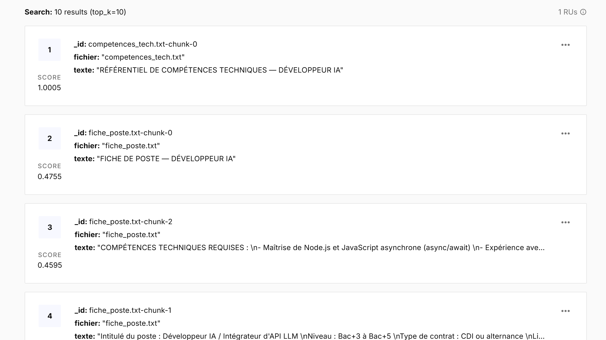
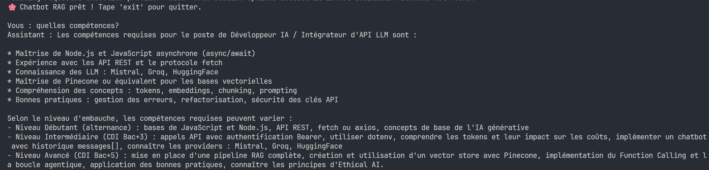
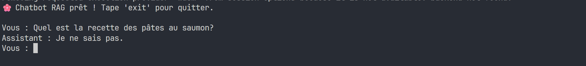

# Chatbot RAG

## Installation

1. Cloner le projet :

## Installation

1. Cloner le projet :

```
git clone https://github.com/NolanLefebvre/ChatbotRag.git
```

2. Aller dans le dossier :

```
cd ChatbotRag
```

3. Créer le fichier `.env` en te basant sur `exemple.env`

4. Installer les dépendances :

```
npm install
```

## Lancement

Lancer le projet avec :

```
npm run start
```

### Stopper le chatbot

Écrire "exit" dans le terminal

### Captures d'écran

- Capture d'écran montrant les vecteurs indexés dans Pinecone :



- Capture d'écran : le chatbot répondant correctement à une question sur le corpus :



- Capture d'écran : le chatbot répondant 'Je ne sais pas' :

